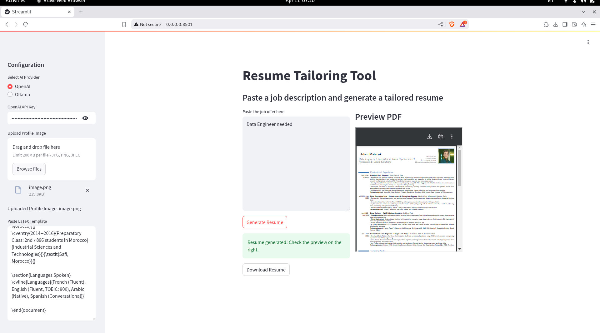

# OverKeef

OverKeef is a modern, user-friendly resume builder designed to help you create professional resumes effortlessly. With its intuitive interface and customizable templates, OverKeef ensures your resume stands out in today's competitive job market.



## Features

- **LaTeX-Powered**: Generate resumes end-to-end using LaTeX, ensuring perfect alignment and professional formatting without worrying about small details.
- **Customizable Templates**: Choose from a variety of professionally designed templates.
- **Real-time Preview**: See changes to your resume as you make them.
- **Export Options**: Download your resume in PDF format.
- **Cross-Platform**: Runs seamlessly on any platform using Docker.

## How to Install

From inside the folder, build the Docker image:

```bash
docker buildx build --progress=plain --platform linux/amd64 -t resume-builder:latest --load .
```

Run the Docker container:

```bash
docker run --platform linux/amd64 -p 8501:8501 resume-builder:latest
```

## How to Use

1. Open your browser and navigate to `http://localhost:8501`.
2. Follow the on-screen instructions to input your details and customize your resume.
3. Preview your resume in real-time.
4. Export your resume as a PDF when you're satisfied with the result.

## Why Choose OverKeef?

- **Ease of Use**: No technical skills required.
- **Professional Results**: Create resumes that leave a lasting impression.
- **Time-Saving**: Build your resume in minutes.
- **LaTeX Integration**: Automatically handles formatting, alignments, and details for a polished, professional look.
- **Open Source**: Contribute and customize the project to suit your needs.

## Contributing

We welcome contributions! To get started:

1. Fork the repository.
2. Create a new branch for your feature or bug fix.
3. Commit your changes and push them to your fork.
4. Submit a pull request with a detailed description of your changes.

## License

This project is licensed under the MIT License. See the `LICENSE` file for details.

## Support

If you encounter any issues or have questions, feel free to open an issue in the repository or contact us directly.
